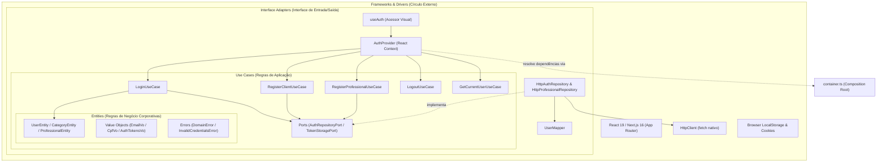

# Arquitetura do Sistema: Clean Architecture Pura (Frontend)

Este documento documenta e formaliza a adoção de **Clean Architecture Pura (Uncle Bob)** no frontend do ServiçoJá (`apps/web`), estruturado para apresentação e defesa técnica em banca acadêmica. A Regra de Dependência é estrita e inegociável: dependências apontam sempre para dentro.

---

## 1. Diagrama dos 4 Círculos Concêntricos

O fluxo de controle e a direção das dependências de código obedecem ao esqueleto concêntrico canônico. Toda seta de importação aponta exclusivamente das camadas externas para as internas:



---

## 2. Mapeamento de Camadas (Uncle Bob × Projeto)

| Círculo Canônico (Uncle Bob) | Pasta do Projeto (`apps/web/src/`) | Responsabilidade Técnica |
| :--- | :--- | :--- |
| **Entities** | `domain/` (entities, value-objects, errors) | Regras de negócio essenciais e invariantes corporativas. Pura tipagem TypeScript e classes sem qualquer dependência externa ou acoplamento a frameworks. |
| **Use Cases** | `application/use-cases/` + `ports/` + `dto/` | Regras de negócio da aplicação. Orquestra o fluxo de dados vindos/enviados para as entidades, dependendo exclusivamente de interfaces abstratas (Ports) de persistência e rede. |
| **Interface Adapters** | `infrastructure/repositories/`, `infrastructure/mappers/`, `presentation/providers/`, `presentation/hooks/` | Adaptadores de dados e fluxo. Traduz dados de APIs e storages externos para formatos aceitáveis pelo domínio (Mappers e Repositórios) e adapta os casos de uso para consumo pelo framework de interface visual (Context Providers e Hooks). |
| **Frameworks & Drivers** | `infrastructure/http/`, `infrastructure/storage/`, Roteamento e Telas do Next.js | Tecnologias, frameworks e ferramentas de terceiros. Banco de dados, fetchers HTTP, mecanismos de cache do navegador e o próprio React/Next.js. São considerados meros detalhes de implementação substituíveis. |

---

## 3. Defesa Teórica: A Distinção Conceitual entre Hook e Caso de Uso

### Por que um Hook React NÃO é um Caso de Uso?
Um **Hook do React** (como `useAuth` ou qualquer outro acessor de estado do React) é um artefato nativo e acoplado a um framework de interface visual. Ele vive na camada de **Interface Adapters** ou **Frameworks & Drivers**. Ele depende do ciclo de renderização do React (`useContext`, `useEffect`, `useState`) e do comportamento do navegador. Por esta razão, um Hook é inerentemente instável e impossível de testar de forma isolada sem renderizadores ou mocks pesados de browser.

Um **Caso de Uso** (como `LoginUseCase`), por outro lado, representa as regras de aplicação puras e a lógica de orquestração do negócio. Ele vive no círculo concêntrico de **Use Cases** e deve ser implementado como uma classe JavaScript/TypeScript pura. Ele não importa nada do React, do Next.js ou de storages do browser. Ele depende única e exclusivamente de portas abstratas (como `AuthRepositoryPort` e `TokenStoragePort`). Isso o torna extremamente testável de forma unitária rápida e o desacopla completamente de qualquer detalhe tecnológico visual.

### Imposição Arquitetural Travada via ESLint Boundaries
Para assegurar a integridade do sistema e evitar que o domínio ou os casos de uso sejam poluídos com código visual ou adaptadores externos, o linter do projeto está configurado de forma estrita no arquivo [eslint.config.mjs](file:///home/alunos/Desktop/chris/Projeto_ProgWeb/apps/web/eslint.config.mjs). Qualquer tentativa de importar uma camada mais externa a partir de uma camada mais interna (como um Caso de Uso tentando importar o React, ou o Domínio tentando importar um repositório HTTP) resultará em erro imediato de build e bloqueio da integração de código:

```javascript
// Exemplo de regra no eslint.config.mjs
{
  files: ["src/domain/**/*.ts"],
  rules: {
    "no-restricted-imports": ["error", {
      patterns: [{
        group: ["**/application/**", "**/infrastructure/**", "**/presentation/**"],
        message: "Regra de Dependência Violada: Camada DOMAIN (Entities) NUNCA deve importar nada de camadas mais externas."
      }]
    }]
  }
}
```
