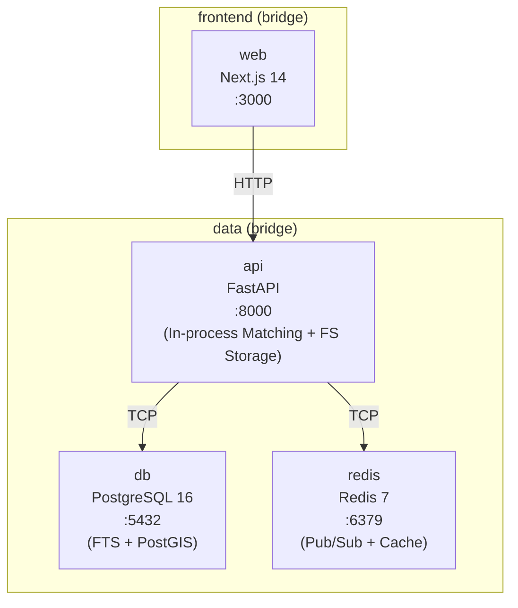

# Design: Redução de Topologia de Containers

## Contexto

A topologia original dispersava responsabilidades em muitos containers de infraestrutura. Este design consolida a estrutura em 4 pilares essenciais: Dados (Postgres), Cache/Mensagens (Redis), Backend (FastAPI + Matching) e Frontend (Next.js).

## Arquitetura Consolidada

## Mudanças por Componente

### 1. Banco de Dados (`db`)
- **FTS (Full-Text Search)**: Configuração de `tsvector` e `tsquery` com dicionário `portuguese` para suportar as buscas que eram feitas no Typesense.
- **Geo-Search**: Uso extensivo de PostGIS (`GIST` index) para filtragem por raio de distância.
- **Embeddings**: Mantido `pgvector` para similaridade semântica.

### 2. API Backend & Matching (`api`)
- **Internalização do Matching Engine**: O código anteriormente em `./apps/matching` é movido para `./apps/api/app/matching`. As chamadas inter-serviços via HTTP são substituídas por chamadas de função assíncronas.
- **Storage Local**: Abstração de storage configurada para usar bind mount local em `./uploads`. O FastAPI expõe esses arquivos via `StaticFiles`.
- **Workers In-Process**: Background tasks do FastAPI gerenciam a fila Redis para processamento VLM e extração de scores NLP, eliminando a necessidade de um container worker separado na v1.

### 3. Remoção de Redes
- A rede `backend` é deletada. A comunicação agora ocorre exclusivamente em `frontend` (API <-> Web) e `data` (API <-> Infra).

## Decisões Técnicas

### D6: Consolidação de Busca no PostgreSQL
- **Escolha**: PostgreSQL FTS + `pg_trgm`.
- **Razão**: Para o volume de dados da v1, o PostgreSQL oferece performance sub-100ms em queries combinadas (FTS + Geo). Elimina o overhead de manter um índice externo sincronizado (Typesense).

### D7: Matching Engine como Módulo
- **Escolha**: Módulo Python interno.
- **Razão**: Latência zero de rede e simplificação do stack. Se o modelo exigir GPU ou recursos isolados no futuro, a extração de volta para microserviço é trivial devido à arquitetura modular.

### D8: Local Filesystem Storage em Dev
- **Escolha**: Bind mount `./uploads`.
- **Razão**: Remove a dependência do MinIO local. A aplicação utiliza uma interface `IStorage` que permite trocar para S3 em produção apenas alterando variáveis de ambiente.
