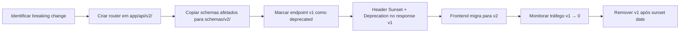

# Spec: api-versioning

> Estratégia de versionamento da API REST (FastAPI) do ServiçoJá. Todas as rotas são prefixadas com `/api/v{N}`. Define estrutura de routers, policy de depreciação, e guia de migração entre versões.

---

## Regra Geral

> [!IMPORTANT]
> - Toda rota pública **MUST** ser prefixada com `/api/v1/`
> - Webhooks externos (MercadoPago) usam `/webhooks/` **sem versão** (contrato fixo com terceiro)
> - Healthcheck usa `/health` **sem versão** (infra)
> - OpenAPI docs em `/docs` e `/openapi.json` **sem versão** (inclui todas as versões)

---

## Estrutura FastAPI — Routers Versionados

```python
# app/main.py
from fastapi import FastAPI
from app.api.v1 import router as v1_router
# from app.api.v2 import router as v2_router  # futuro

app = FastAPI(title="ServiçoJá API", version="1.0.0")

# Versioned API
app.include_router(v1_router, prefix="/api/v1")
# app.include_router(v2_router, prefix="/api/v2")  # futuro

# Unversioned
app.include_router(webhooks_router, prefix="/webhooks")

@app.get("/health")
async def health():
    return {"status": "ok"}
```

```python
# app/api/v1/__init__.py
from fastapi import APIRouter
from app.api.v1 import auth, requests, bids, contracts, reviews,
    messages, notifications, professionals, search, favorites, push, admin

router = APIRouter()
router.include_router(auth.router,          prefix="/auth",          tags=["Auth"])
router.include_router(requests.router,      prefix="/requests",      tags=["Requests"])
router.include_router(bids.router,          prefix="/bids",          tags=["Bids"])
router.include_router(contracts.router,     prefix="/contracts",     tags=["Contracts"])
router.include_router(reviews.router,       prefix="/reviews",       tags=["Reviews"])
router.include_router(messages.router,      prefix="/contracts",     tags=["Messages"])
router.include_router(notifications.router, prefix="/notifications", tags=["Notifications"])
router.include_router(professionals.router, prefix="/professionals", tags=["Professionals"])
router.include_router(search.router,        prefix="/search",        tags=["Search"])
router.include_router(favorites.router,     prefix="/favorites",     tags=["Favorites"])
router.include_router(push.router,          prefix="/push",          tags=["Push"])
router.include_router(admin.router,         prefix="/admin",         tags=["Admin"])
```

### Estrutura de diretórios

```
apps/api/
├── app/
│   ├── main.py
│   ├── api/
│   │   ├── v1/
│   │   │   ├── __init__.py       # Router aggregator
│   │   │   ├── auth.py
│   │   │   ├── requests.py
│   │   │   ├── bids.py
│   │   │   ├── contracts.py
│   │   │   ├── reviews.py
│   │   │   ├── messages.py
│   │   │   ├── notifications.py
│   │   │   ├── professionals.py
│   │   │   ├── search.py
│   │   │   ├── favorites.py
│   │   │   ├── push.py
│   │   │   └── admin.py
│   │   └── v2/                   # futuro — copiar-e-modificar
│   │       └── ...
│   ├── webhooks/
│   │   └── mercadopago.py        # sem versão
│   ├── schemas/                  # Pydantic v2 schemas (compartilhados entre versões)
│   │   ├── v1/                   # schemas exclusivos da v1
│   │   └── shared/               # schemas reutilizados entre versões
│   ├── services/                 # Business logic (sem versão, compartilhado)
│   ├── models/                   # SQLAlchemy models (sem versão)
│   └── core/                     # Config, security, deps
```

> [!TIP]
> **Services e Models nunca são versionados.** Apenas routers e schemas mudam entre versões. A lógica de negócio é compartilhada — isso evita duplicação e bugs de divergência.

---

## Mapa Completo de Endpoints — v1

### Auth (`/api/v1/auth`)

| Método | Rota | Tipo | Descrição |
|--------|------|------|-----------|
| `POST` | `/api/v1/auth/register` | Público | Registro de cliente |
| `POST` | `/api/v1/auth/login` | Público | Login (email + senha) |
| `POST` | `/api/v1/auth/refresh` | Público | Renovar access token |
| `POST` | `/api/v1/auth/oauth/google` | Público | Login OAuth2 Google |
| `GET` | `/api/v1/auth/me` | Autenticado | Perfil do usuário logado |
| `PATCH` | `/api/v1/auth/me` | Autenticado | Atualizar perfil (UserUpdate) |
| `DELETE` | `/api/v1/auth/me` | Autenticado | Exclusão de conta (LGPD) |
| `GET` | `/api/v1/auth/me/consents` | Autenticado | Listar consentimentos LGPD |

### Professionals (`/api/v1/professionals`)

| Método | Rota | Tipo | Descrição |
|--------|------|------|-----------|
| `POST` | `/api/v1/professionals` | Público | Cadastro de profissional |
| `GET` | `/api/v1/professionals/me` | Profissional | Perfil próprio |
| `PATCH` | `/api/v1/professionals/me` | Profissional | Atualizar perfil |
| `GET` | `/api/v1/professionals/me/metrics` | Profissional | Métricas (earnings, conversão) |
| `GET` | `/api/v1/professionals/:slug` | Público | Perfil público (SEO) |

### Requests (`/api/v1/requests`)

| Método | Rota | Tipo | Descrição |
|--------|------|------|-----------|
| `POST` | `/api/v1/requests` | Cliente | Criar pedido de serviço |
| `GET` | `/api/v1/requests` | Cliente | Listar pedidos do cliente |
| `GET` | `/api/v1/requests/:id` | Autenticado | Detalhes do pedido |
| `GET` | `/api/v1/requests/:id/matches` | Cliente | Top-10 profissionais |
| `GET` | `/api/v1/requests/:id/bids` | Cliente | Listar bids recebidos |

### Categories (`/api/v1/categories`)

| Método | Rota | Tipo | Descrição |
|--------|------|------|-----------|
| `GET` | `/api/v1/categories` | Público | Árvore de categorias |

### Bids (`/api/v1/bids`)

| Método | Rota | Tipo | Descrição |
|--------|------|------|-----------|
| `POST` | `/api/v1/bids` | Profissional | Enviar proposta (BidCreate) |
| `GET` | `/api/v1/bids` | Profissional | Listar bids enviados |
| `PATCH` | `/api/v1/bids/:id` | Cliente | Aceitar/rejeitar bid |

### Contracts (`/api/v1/contracts`)

| Método | Rota | Tipo | Descrição |
|--------|------|------|-----------|
| `GET` | `/api/v1/contracts/:id` | Autenticado | Detalhes do contrato |
| `POST` | `/api/v1/contracts/:id/payment` | Cliente | Iniciar pagamento |
| `POST` | `/api/v1/contracts/:id/dispute` | Autenticado | Abrir disputa |
| `GET` | `/api/v1/contracts/:id/messages` | Autenticado | Histórico de chat (paginado) |

### Disputes (`/api/v1/disputes`)

| Método | Rota | Tipo | Descrição |
|--------|------|------|-----------|
| `POST` | `/api/v1/disputes/:id/response` | Autenticado | Responder disputa |

### Reviews (`/api/v1/reviews`)

| Método | Rota | Tipo | Descrição |
|--------|------|------|-----------|
| `POST` | `/api/v1/reviews` | Cliente | Criar avaliação (ReviewCreate) |

### Notifications (`/api/v1/notifications`)

| Método | Rota | Tipo | Descrição |
|--------|------|------|-----------|
| `GET` | `/api/v1/notifications` | Autenticado | Listar notificações |
| `PATCH` | `/api/v1/notifications/mark-read` | Autenticado | Marcar como lidas |

### Search (`/api/v1/search`)

| Método | Rota | Tipo | Descrição |
|--------|------|------|-----------|
| `GET` | `/api/v1/search/professionals` | Público | Busca geo + full-text |

### Favorites (`/api/v1/favorites`)

| Método | Rota | Tipo | Descrição |
|--------|------|------|-----------|
| `POST` | `/api/v1/favorites` | Cliente | Adicionar favorito |
| `GET` | `/api/v1/favorites` | Cliente | Listar favoritos |
| `DELETE` | `/api/v1/favorites/:id` | Cliente | Remover favorito |

### Push (`/api/v1/push`)

| Método | Rota | Tipo | Descrição |
|--------|------|------|-----------|
| `POST` | `/api/v1/push/subscribe` | Autenticado | Registrar subscription Web Push |

### Admin (`/api/v1/admin`)

| Método | Rota | Tipo | Descrição |
|--------|------|------|-----------|
| `PATCH` | `/api/v1/admin/professionals/:id` | Admin | Aprovar/rejeitar profissional |
| `GET` | `/api/v1/admin/professionals` | Admin | Listar profissionais pendentes |
| `GET` | `/api/v1/admin/disputes` | Admin | Listar disputas |
| `PATCH` | `/api/v1/admin/disputes/:id` | Admin | Resolver disputa |
| `GET` | `/api/v1/admin/metrics` | Admin | KPIs gerais |

### Matching Microservice (interno, sem versão pública)

| Método | Rota | Tipo | Descrição |
|--------|------|------|-----------|
| `POST` | `http://matching:8001/score` | Interno | Scoring LightGBM |
| `GET` | `http://matching:8001/health` | Interno | Healthcheck |

### Webhooks (sem versão)

| Método | Rota | Tipo | Descrição |
|--------|------|------|-----------|
| `POST` | `/webhooks/mercadopago` | Externo | Webhook de pagamento MercadoPago |

### Infra (sem versão)

| Método | Rota | Tipo | Descrição |
|--------|------|------|-----------|
| `GET` | `/health` | Público | Healthcheck |
| `GET` | `/docs` | Público | Swagger UI (OpenAPI) |
| `GET` | `/openapi.json` | Público | Schema OpenAPI 3.1 |

---

## Resumo v1

| Grupo | Endpoints | Autenticação |
|-------|-----------|-------------|
| Auth | 8 | Misto |
| Professionals | 5 | Misto |
| Requests | 5 | Cliente |
| Categories | 1 | Público |
| Bids | 3 | Profissional / Cliente |
| Contracts | 4 | Autenticado |
| Disputes | 1 | Autenticado |
| Reviews | 1 | Cliente |
| Notifications | 2 | Autenticado |
| Search | 1 | Público |
| Favorites | 3 | Cliente |
| Push | 1 | Autenticado |
| Admin | 5 | Admin |
| Webhooks | 1 | Externo (HMAC) |
| Infra | 3 | Público |
| **Total** | **44** | |

---

## Política de Versionamento e Deprecação

### Quando criar v2 de um endpoint

Uma nova versão **MUST** ser criada quando:
1. **Breaking change no request body** — campo obrigatório removido/renomeado
2. **Breaking change no response body** — campo removido, tipo alterado, estrutura diferente
3. **Mudança de semântica** — mesmo endpoint mas comportamento diferente
4. **Reestruturação de URL** — endpoint movido para outra hierarquia

Uma nova versão **MUST NOT** ser criada quando:
1. **Adição de campo opcional** no request (backward-compatible)
2. **Adição de campo** no response (forward-compatible)
3. **Bugfix** (mesma semântica, corrigida)
4. **Melhoria de performance** (mesma interface)

### Fluxo de criação de v2



### Headers de deprecação (RFC 8594)

Quando um endpoint v1 for deprecated, o response **MUST** incluir:

```http
Deprecation: true
Sunset: Sat, 01 Jan 2027 00:00:00 GMT
Link: </api/v2/requests>; rel="successor-version"
```

### Critérios de remoção de v1

Um endpoint v1 deprecated **MAY** ser removido quando **TODAS** as condições forem atendidas:

| Critério | Regra |
|----------|-------|
| **Tempo mínimo** | ≥ 6 meses após data do header `Deprecation` |
| **Tráfego** | 0 requests em 30 dias consecutivos (monitorar via OpenTelemetry) |
| **Frontend atualizado** | Todas as chamadas do frontend apontam para v2 |
| **Documentação** | Changelog publicado com guia de migração |
| **Notificação** | E-mail enviado a integrações externas (se aplicável) 30 dias antes |

### Tabela de versões (template para futuro)

| Endpoint | v1 Status | v2 Status | Breaking Change | Sunset Date |
|----------|-----------|-----------|-----------------|-------------|
| `POST /auth/register` | ✅ Ativo | — | — | — |
| `GET /requests` | ✅ Ativo | — | — | — |
| `POST /bids` | ✅ Ativo | — | — | — |
| _Exemplo futuro:_ | ⚠️ Deprecated | ✅ Ativo | Response reestruturado | 2027-06-01 |

> [!NOTE]
> **v1 é a única versão ativa.** A tabela acima será preenchida quando quebras de contrato forem necessárias. Até lá, todos os endpoints são `/api/v1/`.

---

## Consumo pelo Frontend

### Server Components (Next.js)

```typescript
// Server Component — fetch direto (container-to-container)
const API_URL = process.env.API_INTERNAL_URL; // http://api:8000

async function getRequests() {
  const res = await fetch(`${API_URL}/api/v1/requests`, {
    headers: { Cookie: cookies().toString() },
    next: { revalidate: 0 },
  });
  return res.json();
}
```

### Client Components (SWR)

```typescript
// Client Component — SWR (browser → API)
const API_URL = process.env.NEXT_PUBLIC_API_URL; // http://localhost:8000

const fetcher = (url: string) =>
  fetch(url, { credentials: "include" }).then((r) => r.json());

function useRequests() {
  return useSWR(`${API_URL}/api/v1/requests`, fetcher);
}
```

### Geração de tipos via OpenAPI

```bash
# Gerar tipos TypeScript a partir do schema OpenAPI (CI)
npx openapi-typescript http://localhost:8000/openapi.json -o apps/web/src/types/api.d.ts
```

O frontend **MUST** usar os tipos gerados — chamadas a endpoints não documentados no schema falham no CI (task 1.10).

---

## Middleware de Versão

```python
# app/core/middleware.py
from fastapi import Request, Response

async def version_header_middleware(request: Request, call_next):
    response: Response = await call_next(request)
    # Adicionar versão da API no header de resposta
    response.headers["X-API-Version"] = "v1"
    return response
```

Para endpoints deprecated:

```python
# app/api/v1/requests.py (futuro, quando deprecated)
from fastapi import APIRouter
from app.core.deprecation import deprecated_route

router = APIRouter()

@router.get("/", deprecated=True)  # OpenAPI marca como deprecated
@deprecated_route(sunset="2027-06-01", successor="/api/v2/requests")
async def list_requests():
    ...
```

```python
# app/core/deprecation.py
from functools import wraps
from fastapi import Response

def deprecated_route(sunset: str, successor: str):
    def decorator(func):
        @wraps(func)
        async def wrapper(*args, response: Response, **kwargs):
            response.headers["Deprecation"] = "true"
            response.headers["Sunset"] = sunset
            response.headers["Link"] = f'<{successor}>; rel="successor-version"'
            return await func(*args, response=response, **kwargs)
        return wrapper
    return decorator
```
