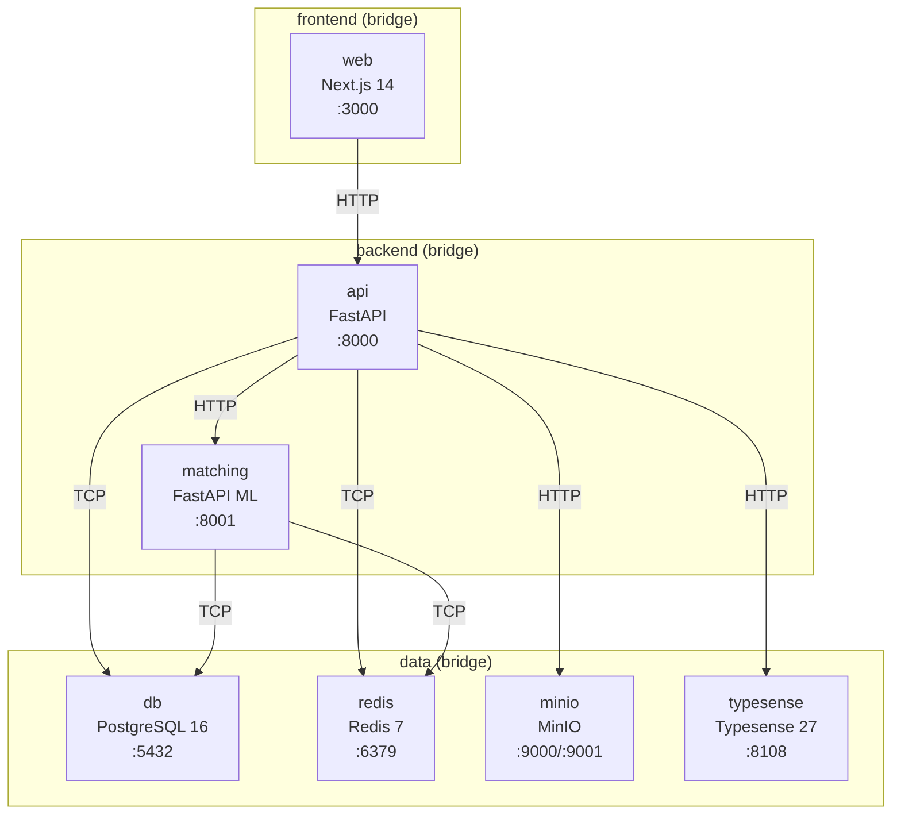
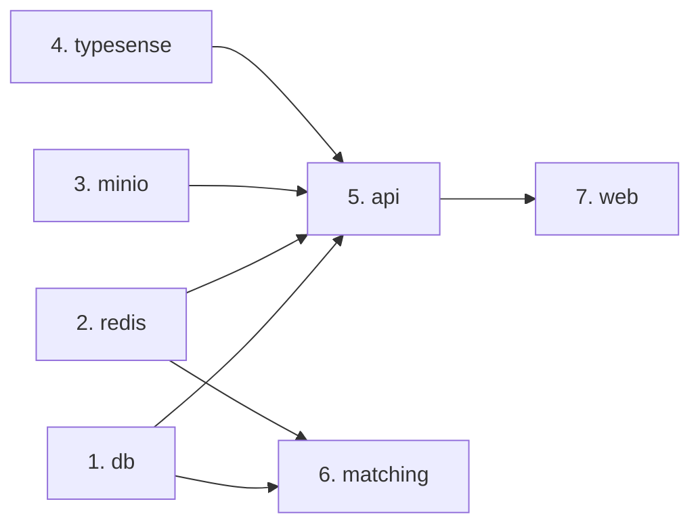

# Spec: docker-topology

> Topologia completa do Docker Compose para desenvolvimento local do ServiçoJá. Define serviços, imagens, redes, volumes, healthchecks, ordem de inicialização e variáveis de ambiente.

---

## Diagrama de Rede



### Redes

| Rede | Serviços | Propósito |
|------|----------|-----------|
| `frontend` | web, api | Frontend acessa apenas a API |
| `backend` | api, matching | BFF se comunica com microservice |
| `data` | api, matching, db, redis, minio, typesense | Acesso a dados e infra |

> [!IMPORTANT]
> **`web` NÃO tem acesso direto ao banco, Redis ou MinIO.** Todo acesso a dados passa pela `api`. O `matching` tem acesso direto ao banco para queries de matching.

---

## Serviços

### 1. `db` — PostgreSQL 16 + PostGIS + pgvector

```yaml
db:
  image: pgvector/pgvector:pg16
  container_name: servicoja-db
  restart: unless-stopped
  ports:
    - "${DB_PORT:-5432}:5432"
  environment:
    POSTGRES_DB: ${DB_NAME}
    POSTGRES_USER: ${DB_USER}
    POSTGRES_PASSWORD: ${DB_PASSWORD}
    POSTGRES_INITDB_ARGS: "--locale=pt_BR.UTF-8"
  volumes:
    - pgdata:/var/lib/postgresql/data
    - ./scripts/init-extensions.sql:/docker-entrypoint-initdb.d/01-extensions.sql:ro
  networks:
    - data
  healthcheck:
    test: ["CMD-SHELL", "pg_isready -U ${DB_USER} -d ${DB_NAME}"]
    interval: 5s
    timeout: 5s
    retries: 5
    start_period: 10s
```

**`scripts/init-extensions.sql`:**
```sql
CREATE EXTENSION IF NOT EXISTS "uuid-ossp";
CREATE EXTENSION IF NOT EXISTS "postgis";
CREATE EXTENSION IF NOT EXISTS "vector";
```

| Item | Valor |
|------|-------|
| **Imagem** | `pgvector/pgvector:pg16` (inclui pgvector; PostGIS instalado via init script) |
| **Porta** | `5432` |
| **Volume** | `pgdata` (named volume, persistente) |
| **Healthcheck** | `pg_isready` |

---

### 2. `redis` — Redis 7

```yaml
redis:
  image: redis:7-alpine
  container_name: servicoja-redis
  restart: unless-stopped
  ports:
    - "${REDIS_PORT:-6379}:6379"
  command: redis-server --requirepass ${REDIS_PASSWORD} --maxmemory 256mb --maxmemory-policy allkeys-lru
  volumes:
    - redisdata:/data
  networks:
    - data
  healthcheck:
    test: ["CMD", "redis-cli", "-a", "${REDIS_PASSWORD}", "ping"]
    interval: 5s
    timeout: 3s
    retries: 5
```

| Item | Valor |
|------|-------|
| **Imagem** | `redis:7-alpine` |
| **Porta** | `6379` |
| **Volume** | `redisdata` (persistência RDB) |
| **Healthcheck** | `redis-cli ping` |
| **Limites** | 256MB, LRU eviction |

---

### 3. `minio` — MinIO (S3-compatible)

```yaml
minio:
  image: minio/minio:latest
  container_name: servicoja-minio
  restart: unless-stopped
  ports:
    - "${MINIO_API_PORT:-9000}:9000"
    - "${MINIO_CONSOLE_PORT:-9001}:9001"
  environment:
    MINIO_ROOT_USER: ${MINIO_ACCESS_KEY}
    MINIO_ROOT_PASSWORD: ${MINIO_SECRET_KEY}
  command: server /data --console-address ":9001"
  volumes:
    - miniodata:/data
  networks:
    - data
  healthcheck:
    test: ["CMD", "mc", "ready", "local"]
    interval: 10s
    timeout: 5s
    retries: 5
    start_period: 10s
```

| Item | Valor |
|------|-------|
| **Imagem** | `minio/minio:latest` |
| **Portas** | `9000` (API S3), `9001` (Console web) |
| **Volume** | `miniodata` |
| **Healthcheck** | `mc ready local` |

---

### 4. `typesense` — Typesense 27

```yaml
typesense:
  image: typesense/typesense:27.1
  container_name: servicoja-typesense
  restart: unless-stopped
  ports:
    - "${TYPESENSE_PORT:-8108}:8108"
  environment:
    TYPESENSE_API_KEY: ${TYPESENSE_API_KEY}
    TYPESENSE_DATA_DIR: /data
  volumes:
    - typesensedata:/data
  networks:
    - data
  healthcheck:
    test: ["CMD", "curl", "-sf", "http://localhost:8108/health"]
    interval: 10s
    timeout: 5s
    retries: 5
```

| Item | Valor |
|------|-------|
| **Imagem** | `typesense/typesense:27.1` |
| **Porta** | `8108` |
| **Volume** | `typesensedata` |
| **Healthcheck** | `curl /health` |

---

### 5. `api` — FastAPI Backend

```yaml
api:
  build:
    context: ./apps/api
    dockerfile: Dockerfile
  container_name: servicoja-api
  restart: unless-stopped
  ports:
    - "${API_PORT:-8000}:8000"
  environment:
    DATABASE_URL: postgresql+asyncpg://${DB_USER}:${DB_PASSWORD}@db:5432/${DB_NAME}
    REDIS_URL: redis://:${REDIS_PASSWORD}@redis:6379/0
    MINIO_ENDPOINT: minio:9000
    MINIO_ACCESS_KEY: ${MINIO_ACCESS_KEY}
    MINIO_SECRET_KEY: ${MINIO_SECRET_KEY}
    MINIO_BUCKET: ${MINIO_BUCKET}
    MINIO_USE_SSL: "false"
    TYPESENSE_HOST: typesense
    TYPESENSE_PORT: "8108"
    TYPESENSE_API_KEY: ${TYPESENSE_API_KEY}
    MATCHING_SERVICE_URL: http://matching:8001
    JWT_SECRET: ${JWT_SECRET}
    JWT_ACCESS_TOKEN_EXPIRE_MINUTES: "15"
    JWT_REFRESH_TOKEN_EXPIRE_DAYS: "7"
    MERCADOPAGO_ACCESS_TOKEN: ${MERCADOPAGO_ACCESS_TOKEN}
    MERCADOPAGO_WEBHOOK_SECRET: ${MERCADOPAGO_WEBHOOK_SECRET}
    GEMINI_API_KEY: ${GEMINI_API_KEY}
    RESEND_API_KEY: ${RESEND_API_KEY}
    VAPID_PUBLIC_KEY: ${VAPID_PUBLIC_KEY}
    VAPID_PRIVATE_KEY: ${VAPID_PRIVATE_KEY}
    OTEL_EXPORTER_OTLP_ENDPOINT: http://otel-collector:4317
    ENVIRONMENT: development
    LOG_LEVEL: debug
  volumes:
    - ./apps/api:/app
  depends_on:
    db:
      condition: service_healthy
    redis:
      condition: service_healthy
    minio:
      condition: service_healthy
    typesense:
      condition: service_healthy
  networks:
    - frontend
    - backend
    - data
  healthcheck:
    test: ["CMD", "curl", "-sf", "http://localhost:8000/health"]
    interval: 10s
    timeout: 5s
    retries: 5
    start_period: 15s
```

**Dockerfile (`apps/api/Dockerfile`):**
```dockerfile
FROM python:3.12-slim
WORKDIR /app
COPY requirements.txt .
RUN pip install --no-cache-dir -r requirements.txt
COPY . .
CMD ["uvicorn", "app.main:app", "--host", "0.0.0.0", "--port", "8000", "--reload"]
```

| Item | Valor |
|------|-------|
| **Imagem** | Custom (Python 3.12-slim) |
| **Porta** | `8000` |
| **Volume** | Bind mount `./apps/api` (hot-reload) |
| **Redes** | `frontend`, `backend`, `data` |
| **depends_on** | db ✅, redis ✅, minio ✅, typesense ✅ (todos com healthcheck) |
| **Healthcheck** | `curl /health` |

---

### 6. `matching` — FastAPI ML Microservice

```yaml
matching:
  build:
    context: ./apps/matching
    dockerfile: Dockerfile
  container_name: servicoja-matching
  restart: unless-stopped
  ports:
    - "${MATCHING_PORT:-8001}:8001"
  environment:
    DATABASE_URL: postgresql+asyncpg://${DB_USER}:${DB_PASSWORD}@db:5432/${DB_NAME}
    REDIS_URL: redis://:${REDIS_PASSWORD}@redis:6379/1
    ENVIRONMENT: development
    LOG_LEVEL: debug
  volumes:
    - ./apps/matching:/app
    - matchingmodels:/app/models
  depends_on:
    db:
      condition: service_healthy
    redis:
      condition: service_healthy
  networks:
    - backend
    - data
  healthcheck:
    test: ["CMD", "curl", "-sf", "http://localhost:8001/health"]
    interval: 10s
    timeout: 5s
    retries: 5
    start_period: 20s
```

**Dockerfile (`apps/matching/Dockerfile`):**
```dockerfile
FROM python:3.12-slim
WORKDIR /app
RUN apt-get update && apt-get install -y --no-install-recommends libgomp1 && rm -rf /var/lib/apt/lists/*
COPY requirements.txt .
RUN pip install --no-cache-dir -r requirements.txt
COPY . .
CMD ["uvicorn", "app.main:app", "--host", "0.0.0.0", "--port", "8001", "--reload"]
```

| Item | Valor |
|------|-------|
| **Imagem** | Custom (Python 3.12-slim + libgomp1 para LightGBM) |
| **Porta** | `8001` |
| **Volumes** | Bind mount `./apps/matching` + `matchingmodels` (modelos treinados) |
| **Redes** | `backend`, `data` |
| **depends_on** | db ✅, redis ✅ |
| **Redis DB** | `1` (separado da API que usa DB `0`) |

---

### 7. `web` — Next.js 14 Frontend

```yaml
web:
  build:
    context: ./apps/web
    dockerfile: Dockerfile
  container_name: servicoja-web
  restart: unless-stopped
  ports:
    - "${WEB_PORT:-3000}:3000"
  environment:
    NEXT_PUBLIC_API_URL: http://localhost:${API_PORT:-8000}
    NEXT_PUBLIC_MINIO_URL: http://localhost:${MINIO_API_PORT:-9000}
    NEXT_PUBLIC_VAPID_PUBLIC_KEY: ${VAPID_PUBLIC_KEY}
    NEXT_PUBLIC_MERCADOPAGO_PUBLIC_KEY: ${MERCADOPAGO_PUBLIC_KEY}
    API_INTERNAL_URL: http://api:8000
  volumes:
    - ./apps/web:/app
    - /app/node_modules
    - /app/.next
  depends_on:
    api:
      condition: service_healthy
  networks:
    - frontend
  healthcheck:
    test: ["CMD", "curl", "-sf", "http://localhost:3000"]
    interval: 10s
    timeout: 5s
    retries: 5
    start_period: 20s
```

**Dockerfile (`apps/web/Dockerfile`):**
```dockerfile
FROM node:20-alpine
WORKDIR /app
COPY package*.json ./
RUN npm ci
COPY . .
CMD ["npm", "run", "dev"]
```

| Item | Valor |
|------|-------|
| **Imagem** | Custom (Node 20-alpine) |
| **Porta** | `3000` |
| **Volumes** | Bind mount `./apps/web` + excludes `node_modules` e `.next` |
| **Redes** | `frontend` (acessa API via `API_INTERNAL_URL`, dados nunca direto) |
| **depends_on** | api ✅ |

> [!NOTE]
> `NEXT_PUBLIC_API_URL` é usada no **client-side** (browser). `API_INTERNAL_URL` é usada em **Server Components** (fetch direto container-to-container via rede Docker).

---

## Volumes

```yaml
volumes:
  pgdata:
    driver: local
  redisdata:
    driver: local
  miniodata:
    driver: local
  typesensedata:
    driver: local
  matchingmodels:
    driver: local
```

| Volume | Serviço | Conteúdo |
|--------|---------|----------|
| `pgdata` | db | Dados PostgreSQL |
| `redisdata` | redis | Snapshots RDB |
| `miniodata` | minio | Objetos S3 (fotos, docs) |
| `typesensedata` | typesense | Índices de busca |
| `matchingmodels` | matching | Modelos LightGBM treinados |

---

## Redes

```yaml
networks:
  frontend:
    driver: bridge
  backend:
    driver: bridge
  data:
    driver: bridge
```

---

## Ordem de Inicialização



| Ordem | Serviço | Espera por |
|-------|---------|-----------|
| 1 | `db` | — |
| 2 | `redis` | — |
| 3 | `minio` | — |
| 4 | `typesense` | — |
| 5 | `api` | db ✅, redis ✅, minio ✅, typesense ✅ |
| 6 | `matching` | db ✅, redis ✅ |
| 7 | `web` | api ✅ |

> Todos os `depends_on` usam `condition: service_healthy` — o serviço só inicia quando a dependência passa o healthcheck.

---

## `.env.example`

```env
# ============================================================
# ServiçoJá — Variáveis de Ambiente (Desenvolvimento Local)
# ============================================================
# Copiar para .env antes de rodar: cp .env.example .env

# ---- PostgreSQL ----
DB_NAME=servicoja
DB_USER=servicoja
DB_PASSWORD=servicoja_dev_2026
DB_PORT=5432

# ---- Redis ----
REDIS_PASSWORD=redis_dev_2026
REDIS_PORT=6379

# ---- MinIO (S3) ----
MINIO_ACCESS_KEY=minio_dev
MINIO_SECRET_KEY=minio_secret_dev_2026
MINIO_BUCKET=servicoja-uploads
MINIO_API_PORT=9000
MINIO_CONSOLE_PORT=9001

# ---- Typesense ----
TYPESENSE_API_KEY=typesense_dev_key_2026
TYPESENSE_PORT=8108

# ---- API (FastAPI) ----
API_PORT=8000
JWT_SECRET=jwt_super_secret_dev_key_change_in_production_2026
JWT_ACCESS_TOKEN_EXPIRE_MINUTES=15
JWT_REFRESH_TOKEN_EXPIRE_DAYS=7

# ---- Matching Microservice ----
MATCHING_PORT=8001

# ---- Frontend (Next.js) ----
WEB_PORT=3000

# ---- MercadoPago (Sandbox) ----
MERCADOPAGO_ACCESS_TOKEN=TEST-xxxx-xxxx-xxxx-xxxxxxxxxxxx
MERCADOPAGO_PUBLIC_KEY=TEST-xxxx-xxxx-xxxx-xxxxxxxxxxxx
MERCADOPAGO_WEBHOOK_SECRET=webhook_secret_dev

# ---- Google Gemini Vision API ----
GEMINI_API_KEY=AIzaSy_your_gemini_api_key_here

# ---- Email (Resend) ----
RESEND_API_KEY=re_xxxxxxxxxxxx
RESEND_FROM_EMAIL=noreply@servicoja.local

# ---- Web Push (VAPID) ----
# Gerar via: npx web-push generate-vapid-keys
VAPID_PUBLIC_KEY=BEl62iUYgUivxIkv69yViEuiBIa-Ib9-SkvMeAtA3LFgDzkOs-
VAPID_PRIVATE_KEY=UUxI4O8-FbRouAevSmBQ6o18hgE4nSG97jN999qUYo4=
VAPID_MAILTO=mailto:dev@servicoja.local

# ---- OpenTelemetry ----
OTEL_EXPORTER_OTLP_ENDPOINT=http://localhost:4317
OTEL_SERVICE_NAME=servicoja-api

# ---- Geral ----
ENVIRONMENT=development
LOG_LEVEL=debug
```

---

## Comandos Úteis

```bash
# Subir tudo
docker compose up -d

# Subir com rebuild
docker compose up -d --build

# Ver logs de um serviço
docker compose logs -f api

# Rodar migrations
docker compose exec api alembic upgrade head

# Criar migration
docker compose exec api alembic revision --autogenerate -m "add_table_x"

# Seed de categorias
docker compose exec api python scripts/seed_categories.py

# Acessar psql
docker compose exec db psql -U servicoja -d servicoja

# Criar bucket MinIO
docker compose exec minio mc alias set local http://localhost:9000 minio_dev minio_secret_dev_2026
docker compose exec minio mc mb local/servicoja-uploads

# Parar tudo
docker compose down

# Reset completo (apaga dados)
docker compose down -v
```
