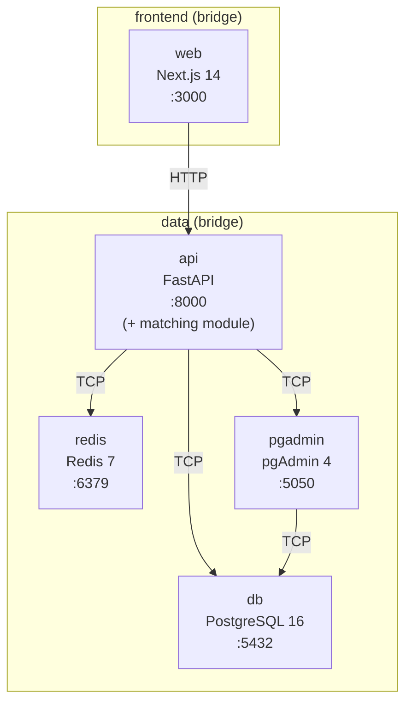
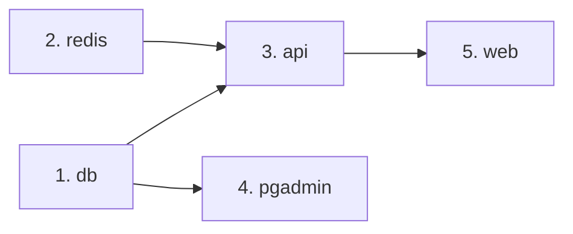

# Spec: docker-topology

> Topologia completa do Docker Compose para desenvolvimento local do ServiçoJá. Define serviços, imagens, redes, volumes, healthchecks, ordem de inicialização e variáveis de ambiente.

---

## Diagrama de Rede



### Redes

| Rede | Serviços | Propósito |
|------|----------|-----------|
| `frontend` | web, api | Frontend acessa apenas a API |
| `data` | api, db, redis, pgadmin | Acesso a dados e infra |

> [!IMPORTANT]
> **`web` NÃO tem acesso direto ao banco ou Redis.** Todo acesso a dados passa pela `api`. O matching engine é executado in-process na `api`.

---

## Serviços

### 1. `db` — PostgreSQL 16 + PostGIS + pgvector

```yaml
db:
  build:
    context: .
    dockerfile: apps/db/Dockerfile
  container_name: servicoja-db
  restart: unless-stopped
  ports:
    - "${DB_PORT:-5432}:5432"
  environment:
    POSTGRES_DB: ${DB_NAME}
    POSTGRES_USER: ${DB_USER}
    POSTGRES_PASSWORD: ${DB_PASSWORD}
    POSTGRES_INITDB_ARGS: "--locale=pt_BR.UTF-8"
  volumes:
    - pgdata:/var/lib/postgresql/data
    - ./scripts/init-extensions.sql:/docker-entrypoint-initdb.d/01-extensions.sql:ro
  networks:
    - data
  healthcheck:
    test: ["CMD-SHELL", "pg_isready -U ${DB_USER} -d ${DB_NAME}"]
    interval: 5s
    timeout: 5s
    retries: 5
    start_period: 10s
```

> [!NOTE]
> O Dockerfile customizado parte de `postgis/postgis:16-3.4` e instala `postgresql-16-pgvector` no topo, resolvendo a incompatibilidade nativa entre as duas extensões em imagens pré-moldadas.

**`scripts/init-extensions.sql`:**
```sql
CREATE EXTENSION IF NOT EXISTS "uuid-ossp";
CREATE EXTENSION IF NOT EXISTS "postgis";
CREATE EXTENSION IF NOT EXISTS "vector";
```

| Item | Valor |
|------|-------|
| **Build** | `apps/db/Dockerfile` (PostGIS 3.4 + pgvector 0.7) |
| **Porta** | `5432` |
| **Volume** | `pgdata` (named volume, persistente) |
| **Healthcheck** | `pg_isready` |

---

### 2. `redis` — Redis 7

```yaml
redis:
  image: redis:7-alpine
  container_name: servicoja-redis
  restart: unless-stopped
  ports:
    - "${REDIS_PORT:-6379}:6379"
  command: redis-server --requirepass ${REDIS_PASSWORD} --maxmemory 256mb --maxmemory-policy allkeys-lru
  volumes:
    - redisdata:/data
  networks:
    - data
  healthcheck:
    test: ["CMD", "redis-cli", "-a", "${REDIS_PASSWORD}", "ping"]
    interval: 5s
    timeout: 3s
    retries: 5
```

| Item | Valor |
|------|-------|
| **Imagem** | `redis:7-alpine` |
| **Porta** | `6379` |
| **Volume** | `redisdata` (persistência RDB) |
| **Healthcheck** | `redis-cli ping` |
| **Limites** | 256MB, LRU eviction |

---

### 3. `api` — FastAPI Backend (Consolidado)

```yaml
api:
  build:
    context: ./apps/api
    dockerfile: Dockerfile
  container_name: servicoja-api
  restart: unless-stopped
  ports:
    - "${API_PORT:-8000}:8000"
  environment:
    DATABASE_URL: postgresql+asyncpg://${DB_USER}:${DB_PASSWORD}@db:5432/${DB_NAME}
    REDIS_URL: redis://:${REDIS_PASSWORD}@redis:6379/0
    UPLOADS_DIR: /app/uploads
    JWT_SECRET: ${JWT_SECRET}
    JWT_ACCESS_TOKEN_EXPIRE_MINUTES: "15"
    JWT_REFRESH_TOKEN_EXPIRE_DAYS: "7"
    MERCADOPAGO_ACCESS_TOKEN: ${MERCADOPAGO_ACCESS_TOKEN}
    MERCADOPAGO_WEBHOOK_SECRET: ${MERCADOPAGO_WEBHOOK_SECRET}
    GEMINI_API_KEY: ${GEMINI_API_KEY}
    RESEND_API_KEY: ${RESEND_API_KEY}
    VAPID_PUBLIC_KEY: ${VAPID_PUBLIC_KEY}
    VAPID_PRIVATE_KEY: ${VAPID_PRIVATE_KEY}
    ENVIRONMENT: development
    LOG_LEVEL: debug
  volumes:
    - ./apps/api:/app
    - ./uploads:/app/uploads
    - ./models:/app/models
  depends_on:
    db:
      condition: service_healthy
    redis:
      condition: service_healthy
  networks:
    - frontend
    - data
  healthcheck:
    test: ["CMD", "curl", "-sf", "http://localhost:8000/health"]
    interval: 10s
    timeout: 5s
    retries: 5
    start_period: 15s
```

| Item | Valor |
|------|-------|
| **Imagem** | Custom (Python 3.12-slim + libgomp1) |
| **Porta** | `8000` |
| **Volume** | Bind mounts: code, `./uploads`, `./models` |
| **Redes** | `frontend`, `data` |
| **depends_on** | db ✅, redis ✅ |
| **Workers** | VLM, NLP, Indexação (in-process) |

---

### 4. `pgadmin` — Administração PostgreSQL

```yaml
pgadmin:
  image: dpage/pgadmin4:latest
  container_name: servicoja-pgadmin
  restart: unless-stopped
  ports:
    - "5050:80"
  environment:
    PGADMIN_DEFAULT_EMAIL: admin@servicoja.local
    PGADMIN_DEFAULT_PASSWORD: admin
  depends_on:
    db:
      condition: service_healthy
  networks:
    - data
```

| Item | Valor |
|------|-------|
| **Imagem** | `dpage/pgadmin4:latest` |
| **Porta** | `5050` |
| **Redes** | `data` |
| **depends_on** | db ✅ |

---

### 5. `web` — Next.js 14 Frontend

```yaml
web:
  build:
    context: ./apps/web
    dockerfile: Dockerfile
  container_name: servicoja-web
  restart: unless-stopped
  ports:
    - "${WEB_PORT:-3000}:3000"
  environment:
    NEXT_PUBLIC_API_URL: http://localhost:${API_PORT:-8000}
    NEXT_PUBLIC_VAPID_PUBLIC_KEY: ${VAPID_PUBLIC_KEY}
    NEXT_PUBLIC_MERCADOPAGO_PUBLIC_KEY: ${MERCADOPAGO_PUBLIC_KEY}
    API_INTERNAL_URL: http://api:8000
    UPLOADS_URL: http://localhost:${API_PORT:-8000}/uploads
  volumes:
    - ./apps/web:/app
    - /app/node_modules
    - /app/.next
  depends_on:
    api:
      condition: service_healthy
  networks:
    - frontend
  healthcheck:
    test: ["CMD", "curl", "-sf", "http://localhost:3000"]
    interval: 10s
    timeout: 5s
    retries: 5
    start_period: 20s
```

**Dockerfile (`apps/web/Dockerfile`):**
```dockerfile
FROM node:20-alpine
WORKDIR /app
COPY package*.json ./
RUN npm ci
COPY . .
CMD ["npm", "run", "dev"]
```

| Item | Valor |
|------|-------|
| **Imagem** | Custom (Node 20-alpine) |
| **Porta** | `3000` |
| **Volumes** | Bind mount `./apps/web` + excludes `node_modules` e `.next` |
| **Redes** | `frontend` (acessa API via `API_INTERNAL_URL`, dados nunca direto) |
| **depends_on** | api ✅ |

> [!NOTE]
> `NEXT_PUBLIC_API_URL` é usada no **client-side** (browser). `API_INTERNAL_URL` é usada em **Server Components** (fetch direto container-to-container via rede Docker).

---

## Volumes

```yaml
volumes:
  pgdata:
    driver: local
  redisdata:
    driver: local
```

| Volume | Serviço | Conteúdo |
|--------|---------|----------|
| `pgdata` | db | Dados PostgreSQL |
| `redisdata` | redis | Snapshots RDB |
| `./uploads` | api | Arquivos enviados (bind mount) |
| `./models` | api | Modelos LightGBM (bind mount) |

---

## Redes

```yaml
networks:
  frontend:
    driver: bridge
  data:
    driver: bridge
```

---

## Ordem de Inicialização



| Ordem | Serviço | Espera por |
|-------|---------|-----------|
| 1 | `db` | — |
| 2 | `redis` | — |
| 3 | `api` | db ✅, redis ✅ |
| 4 | `pgadmin` | db ✅ |
| 5 | `web` | api ✅ |

> Todos os `depends_on` usam `condition: service_healthy` — o serviço só inicia quando a dependência passa o healthcheck.

---

## Workers Assíncronos (v1)

Os workers de background (pipeline VLM, indexação Typesense, NLP de reviews) rodam **dentro do container `api`** via `asyncio` background tasks do FastAPI, sem container separado.

| Worker | Trigger | Destino |
|--------|---------|----------|
| VLM (Gemini Vision) | Upload de imagem → fila Redis (DB 0) | `requests.ai_*` no PostgreSQL |
| Indexação FTS | Profissional aprovado/atualizado | `professionals.search_vector` (PostgreSQL) |
| NLP de reviews | Review criada → fila Redis (DB 0) | `reviews.score_*` no PostgreSQL |
| Matching Engine | Request via API | In-process execution |

> [!NOTE]
> **Decisão v1**: Workers in-process (FastAPI background tasks + ARQ sobre Redis) simplificam o deploy inicial sem container adicional.
> **Path para v2**: Extrair para container `worker` separado com `arq` ou `celery` quando o volume de processamento justificar escala independente da API HTTP.

---

## `.env.example`

> Consulte o arquivo `.env.example` na raiz do projeto. Este documento não duplica variáveis para evitar drift.

---

## Comandos Úteis

```bash
# Subir tudo
docker compose up -d

# Subir com rebuild
docker compose up -d --build

# Ver logs de um serviço
docker compose logs -f api

# Acessar psql
docker compose exec db psql -U servicoja -d servicoja

# Parar tudo
docker compose down

# Reset completo (apaga dados)
docker compose down -v
```
